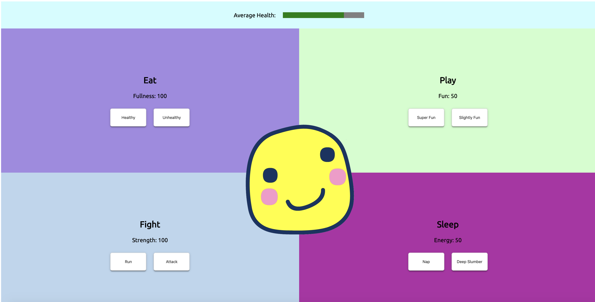
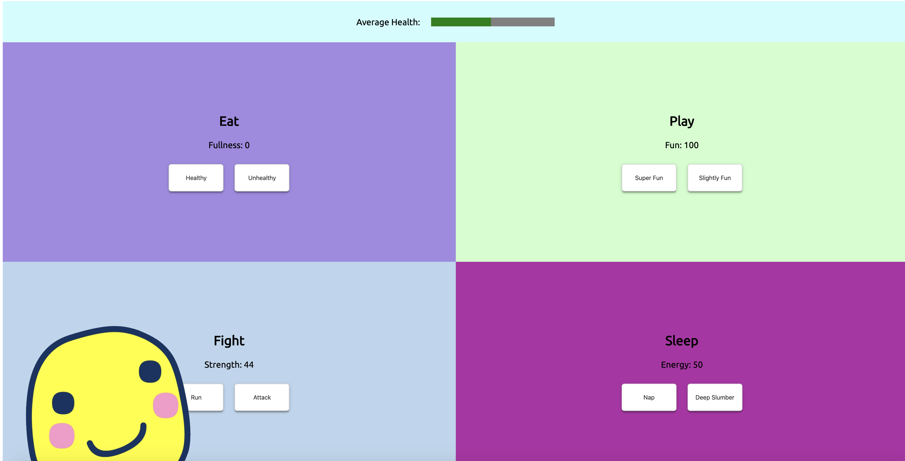
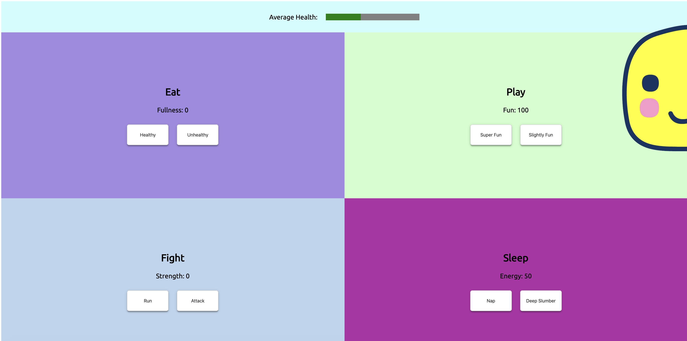

# tamagotchi

## Description
This app roughly simulates the Tamagotchi game that was extremely popular in the 90's.  The user will see their tamagotchi pet in the center of the screen, and see that the page is also split into quadrants that each allow the user to interact with the tamagotchi in a different way and see its score and overall wellness change.  The four interactions are as follows: Eat, Play, Fight, Sleep.  Each section displays the tamagotchi's "score", or overall satisfaction with that interaction, and has two buttons that trigger different activities that make the score go up or down based on randomly generated numbers.  At the top, there is an overall health bar that tracks the average of all 4 scores.  As an extra included feature, as the user clicks on each button, the tamagotchi image will move around.
## Screenshots

## How To Run
1. Clone down this repository.
2. In the command line, run `npm install`.
3. After the installation is complete, in the command line, run `npm start`.